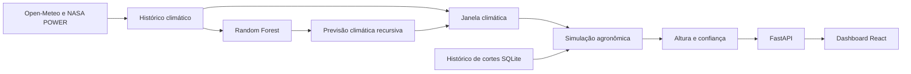

# EcoTrack

EcoTrack é um sistema full-stack de monitoramento preditivo da vegetação nas
margens do Rodoanel Mário Covas (SP-021). Ele combina dados climáticos reais,
previsão de clima por Machine Learning e uma simulação agronômica para estimar
a altura de cinco espécies de grama por trecho e apoiar o planejamento de
roçada.

> O projeto ainda é um protótipo operacional. Autenticação, alocação real de
> equipes, exportações oficiais e garantias estruturais para números produzidos
> pelo chatbot continuam pendentes. A interface identifica ou desativa esses
> fluxos quando eles são apenas demonstrativos.

## Como o sistema funciona



O modelo de Machine Learning prevê somente as variáveis climáticas futuras:
temperatura, precipitação, umidade, radiação e vento. A altura da grama é
calculada por `Backend/src/growth.py`, usando o clima real ou previsto e o
estado inicial do corte vigente.

Regras centrais:

- as cinco espécies coexistem e são simuladas separadamente em cada trecho;
- sem filtro de espécie, o mapa usa a espécie mais alta da célula;
- criticidade: verde até 15 cm, amarelo acima de 15 até 25 cm e vermelho acima
  de 25 cm;
- cortes formam um histórico: vence a data mais recente; no empate, o corte
  pontual vence o global; persistindo o empate, vence o último inserido;
- excluir um corte permite que o registro aplicável anterior volte a valer;
- números operacionais do chatbot devem vir das ferramentas allowlisted do
  backend. A garantia determinística dessa regra ainda é uma melhoria pendente.

## Tecnologias

- Backend: Python 3.12, FastAPI, Pydantic, pandas, NumPy, scikit-learn,
  SQLite, Requests e Google Gen AI.
- Frontend: React 19, Vite, React Router, Tailwind CSS, Axios, Leaflet,
  Recharts e jsPDF.
- Qualidade: pytest, ESLint, GitHub Actions e CodeQL.

## Estrutura

```text
EcoTrack/
├── Backend/
│   ├── src/                  # API, clima, ML, crescimento, cortes e chatbot
│   ├── scripts/              # pipeline offline
│   ├── tests/                # testes pytest
│   ├── data/                 # rota e artefatos climáticos versionados
│   └── models/               # metadata; joblib é gerado localmente
├── frontend/
│   ├── src/api/              # configuração HTTP compartilhada
│   ├── src/components/
│   ├── src/layout/
│   └── src/pages/
├── .github/workflows/        # CI, CodeQL e rebuild manual do modelo
└── AUDITORIA_TECNICA.md      # achados, correções e riscos restantes
```

## Requisitos

- Python 3.12
- Node.js 22 e npm
- acesso à internet para reconstruir o histórico e o modelo
- `GEMINI_API_KEY` somente se o chatbot for utilizado

## Executando o backend

Todos os comandos desta seção partem de `Backend/`:

```bash
cd Backend
python3 -m venv .venv
source .venv/bin/activate
python -m pip install --upgrade pip
python -m pip install -r requirements-dev.txt
cp .env.example .env
```

O repositório não versiona `models/climate_model.joblib`. Na primeira execução,
ou quando os artefatos precisarem ser reconstruídos, rode:

```bash
python -m scripts.build_pipeline
```

Esse comando consulta Open-Meteo e NASA POWER, atualiza os CSVs climáticos,
treina o Random Forest e gera uma previsão recursiva de 365 dias.

Inicie a API:

```bash
uvicorn src.api:app --reload --env-file .env
```

- API: `http://127.0.0.1:8000`
- Swagger: `http://127.0.0.1:8000/docs`
- Health: `http://127.0.0.1:8000/health`

Sem `GEMINI_API_KEY`, apenas as rotas `/chat*` ficam indisponíveis. Nunca
coloque essa chave no frontend.

## Executando o frontend

Em outro terminal:

```bash
cd frontend
cp .env.example .env.local
npm ci
npm run dev
```

`VITE_ECOTRACK_API_URL` define a URL pública do backend. Se ela não for
informada, o frontend usa `http://127.0.0.1:8000`.

Para produção, configure também `ECOTRACK_CORS_ORIGINS` no backend com as
origens exatas do frontend. O valor padrão aberto existe apenas para preservar
o desenvolvimento local.

## Endpoints principais

| Método | Endpoint | Finalidade |
|---|---|---|
| `GET` | `/health` | Estado do artefato de modelo |
| `GET` | `/status/apis` | Disponibilidade de Open-Meteo e NASA POWER |
| `GET` | `/modelo` | Metadata e métricas do modelo climático |
| `GET` | `/pontos` | Pontos de monitoramento cadastrados |
| `GET` | `/especies` | Espécies simuladas |
| `GET` | `/variaveis-x` | Altura e confiança para coordenada/espécie |
| `GET` | `/variaveis-x/ponto/{id}` | Consulta de um ponto cadastrado |
| `GET` | `/mapa/rodovia` | Varredura da rodovia e criticidade por célula |
| `GET` | `/crescimento/serie` | Série temporal das cinco espécies |
| `GET/POST` | `/cortes` | Consulta e registro do histórico de cortes |
| `DELETE` | `/cortes/{id}` | Exclusão de um registro de corte |
| `GET` | `/cortes/vigente` | Corte efetivo para coordenada e data |
| `POST` | `/historico/atualizar` | Coleta dados e retreina o modelo |
| `POST` | `/previsao/gerar` | Materializa a previsão climática recursiva |
| `POST` | `/chat` | Chatbot sem streaming |
| `POST` | `/chat/stream` | Chatbot via SSE |

As rotas de escrita e pipeline ainda não possuem autenticação. Não exponha esta
API diretamente à internet antes de implementar identidade, autorização e
limites operacionais.

## Testes e verificações

Backend:

```bash
cd Backend
ECOTRACK_DB_PATH=/tmp/ecotrack-tests.db python -m pytest -q
python -m compileall -q src scripts
python -m pip check
```

Frontend:

```bash
cd frontend
npm run lint
npm run build
npm audit
```

O CI executa testes e compilação do backend, além de lint e build do frontend.
O rebuild climático é manual porque consulta serviços externos e substitui os
artefatos gerados.

## Estado conhecido

- o checkout pode iniciar sem o joblib; `/health` reportará
  `modelo_ausente` até a execução do pipeline;
- o bundle frontend ainda gera um aviso de tamanho e deve ser dividido em uma
  etapa de performance;
- login/RBAC, CORS de produção, ciclo versionado dos artefatos e respostas
  operacionais determinísticas do chatbot precisam de decisão arquitetural;
- confiança recursiva, imputação climática e alguns limites agronômicos ainda
  exigem calibração e validação de campo;
- dados de equipes, alertas e exportações oficiais não estão integrados.

Consulte o [relatório técnico](AUDITORIA_TECNICA.md) para severidades,
evidências, correções já aplicadas e riscos restantes. A documentação detalhada
do backend está em [Backend/README.md](Backend/README.md), com guias de
[inicialização](Backend/COMO-INICIALIZAR.md) e
[integração](Backend/COMO-CONECTAR.md).
